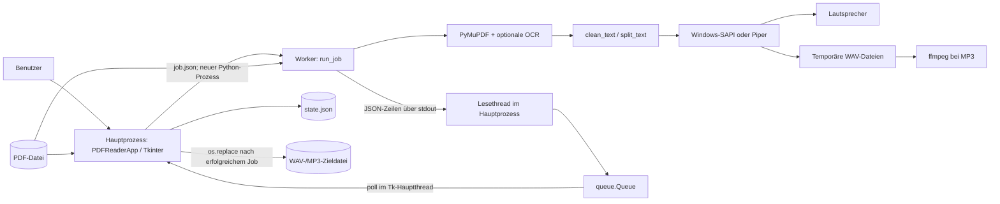

# Technische Architektur von Speechy

Stand: 3. Oktober 2026. Diese Dokumentation beschreibt die Implementierung von
`text2speech/reader1.py` auf Basis von Commit
`090fe0537bca356cfdc15e3c5bee42b6d6ea8f56`. Sie beschreibt den vorhandenen Code;
Erweiterungsvorschläge stehen im letzten Abschnitt. Der ergänzte automatische
Startpfad ist in Abschnitt 12 dokumentiert.

## 1. Zweck und Systemgrenze

Speechy ist eine lokale Desktop-Anwendung für Windows. Sie liest PDF-Text vor,
erkennt optional Text auf gescannten Seiten und exportiert ein vollständiges
Dokument als WAV oder MP3. Deutsch und Englisch werden explizit ausgewählt;
automatische Spracherkennung und Übersetzung sind für den PDF-Vorleser nicht implementiert.
Der ergänzte Speech-to-Text-Pfad ist in Abschnitt 13 beschrieben und bietet auch
eine automatische Sprachauswahl für Audiodateien und Diktate.

Die Anwendung verwendet keine Netzwerk-API. Python-Pakete, Piper-Modelle,
OCR-Sprachdaten und gegebenenfalls ffmpeg müssen vorab installiert sein.
Einrichtung und Downloads können Internet benötigen; die Verarbeitung nutzt
anschließend lokale Dateien und Engines.

## 2. Repository und Abhängigkeiten

```text
speechy/
├── README.md                 Einrichtung und Bedienung
├── architecture.md           Technische Dokumentation
├── requirements.txt          PyMuPDF und pyttsx3
├── requirements-piper.txt    Basis-Abhängigkeiten plus Piper
├── text2speech/
│   └── reader1.py             GUI, Job-Steuerung und Worker-Einstieg
└── tests/
    └── test_reader.py         Automatisierte Tests
```

| Bestandteil | Aufgabe | Voraussetzung |
| --- | --- | --- |
| Python / Tkinter / ttk | Oberfläche, Dateidialoge und Ereignisschleife | Windows-Python mit funktionsfähigem Tcl/Tk; README empfiehlt Python 3.11/3.12, 64 Bit |
| `PyMuPDF>=1.24,<2` | PDF-Prüfung, Textextraktion und Tesseract-Anbindung | Wird als `pymupdf as fitz` importiert |
| `pyttsx3>=2.98,<3` | Windows-SAPI-Ausgabe und WAV-Erzeugung | Passende lokal installierte SAPI-Stimmen |
| `piper-tts>=1.3,<2` | Lokale neuronale Sprachsynthese | Optional; `.onnx` und passende `.onnx.json` |
| Tesseract-Sprachdaten | OCR für Deutsch oder Englisch | Optional; `deu.traineddata` / `eng.traineddata` |
| `winsound` | Wiedergabe von Piper-WAVs | Bestandteil von Python unter Windows |
| ffmpeg | WAV nach MP3 konvertieren | Optional; ausführbar über `PATH`, Encoder `libmp3lame` |

Die Versionsbereiche sind keine reproduzierbare Lockdatei. Die GUI lässt sich
regulär nur unter Windows starten; die internen Worker- und Hilfsfunktionen haben
keine durchgehend plattformneutrale Schnittstelle.

## 3. Komponenten und Prozessmodell



### Hauptprozess

`PDFReaderApp` besitzt alle Tk-Widgets, Tk-Variablen und den sichtbaren
Anwendungszustand. Ein eigenes PyMuPDF-Dokument dient zum Prüfen der ausgewählten
Datei und zur normalen Textvorschau. Das Öffnen und diese Vorschau erfolgen
synchron im GUI-Thread; große oder komplexe PDFs können ihn dabei kurz blockieren.

### Worker-Prozess

`launch_job()` startet dieselbe Python-Datei mit demselben Interpreter:

```text
python text2speech/reader1.py --job <Pfad zu job.json>
```

Der `--job`-Einstieg lädt die Konfiguration und ruft `run_job()` auf. Der Worker
öffnet die PDF unabhängig vom GUI-Dokument und besitzt seine eigene TTS-Engine.
Piper beziehungsweise SAPI wird einmal pro Job initialisiert. Zwischen den
Prozessen werden keine Tk-Objekte oder PyMuPDF-Dokumentobjekte geteilt.

Diese Trennung erlaubt den Abbruch auch während blockierender OCR, Synthese oder
Wiedergabe. Der Worker ist eine interne Ausführungskomponente, keine öffentliche,
vollständig validierte Kommandozeilen-API.

### Lesethread und Ereignisverarbeitung

Ein Daemon-Thread liest ausschließlich die Prozessausgabe und legt Zeilen in
`self.events`. Er verändert keine Widgets. `poll()` verarbeitet im Tk-Hauptthread
bis zu 100 Queue-Einträge pro Durchlauf und plant den nächsten Durchlauf mit
`root.after(80, ...)`. Die 80 ms sind ein Polling-Intervall, keine garantierte
Reaktionszeit. Die Queue hat keine Größenbegrenzung oder Backpressure.

## 4. Job-Konfiguration

Die GUI schreibt einen Snapshot der Einstellungen nach `job.json` im temporären
Job-Verzeichnis. Änderungen während eines Jobs ändern diesen Snapshot nicht.

| Feld | Typ / Werte | Bedeutung |
| --- | --- | --- |
| `pdf` | String | Absoluter Pfad der geöffneten PDF |
| `page` | Integer, ab 0 | Startseite; beim Export immer 0 |
| `chunk` | Integer, ab 0 | Startblock auf der ersten Job-Seite; beim Export 0 |
| `backend` | `Windows` oder `Piper` | Sprachsynthese-Backend |
| `language` | `Deutsch` oder `Englisch` | SAPI-Sprachwahl, Piper-Modellzuordnung und OCR-Sprache |
| `model` | String | Ausgewähltes Piper-Modell; für Windows ungenutzt |
| `rate` | Integer | GUI-Bereich 100–240; Standard 165 |
| `ocr` | Boolean | OCR aktivieren, wenn die normale Extraktion keinen Text liefert |
| `tessdata` | String | Sprachdatenordner; leer lässt PyMuPDF die Umgebung verwenden |
| `export` | `""`, `.wav` oder `.mp3` | Vorlesen oder Exportformat |
| `ffmpeg` | String oder `null` | Über `shutil.which()` ermittelter Programmpfad |
| `workdir` | String | Temporäres Verzeichnis; ergänzt durch `launch_job()` |

`job_config()` prüft unter anderem, ob eine PDF geöffnet ist, die Piper-Dateien
vorhanden sind und bei MP3 ffmpeg verfügbar ist. Inhalt und Kompatibilität des
Piper-Modells werden erst beim Laden im Worker geprüft. OCR-Sprachdaten werden
erst beim tatsächlichen OCR-Aufruf geprüft.

## 5. Nachrichtenprotokoll

`emit()` schreibt pro Nachricht ein JSON-Objekt als einzelne Zeile nach stdout und
flusht den Stream. `ensure_ascii=True` maskiert Unicode-Zeichen. stderr wird beim
Prozessstart nach stdout umgeleitet; Zeilen ohne gültiges JSON ignoriert `poll()`.

| `kind` | Nutzdaten | Zeitpunkt / Behandlung |
| --- | --- | --- |
| `status` | `text` | Fortschritt, OCR-Phase oder Konvertierung; aktualisiert die Statusanzeige |
| `page` | `page`, `text` | Nach Extraktion einer Seite, auch wenn sie leer ist; beim Vorlesen Vorschau und Lesezeichen aktualisieren |
| `chunk` | `page`, `chunk` | Vor Synthese/Wiedergabe eines Blocks; markiert dessen Beginn |
| `position` | `page`, `chunk` | Nach Verarbeitung eines Blocks; `chunk` ist der nächste Blockindex |
| `done` | `text` | Verarbeitung abgeschlossen; GUI setzt ein Erfolgsmerkmal |
| `error` | `text` | Unbehandelte Worker-Ausnahme; GUI zeigt Fehlermeldung, Worker endet mit Code 1 |

Das Stream-Ende wird vom Lesethread als lokaler Queue-Eintrag mit `line=None`
gemeldet. Ein erfolgreicher Abschluss erfordert sowohl Exit-Code 0 als auch eine
empfangene `done`-Nachricht. Erst dann darf die GUI einen Export übernehmen.

Jeder Queue-Eintrag erhält im Lesethread die zugehörige `generation`. Start und
Abbruch erhöhen diesen Zähler. `poll()` verwirft Einträge einer älteren Generation
oder ohne aktiven Job. Die Generation ist kein Feld im Worker-JSON; sie schützt
die GUI vor verspäteten Nachrichten einer vorherigen Sitzung. Die Nutzdaten
gültiger JSON-Nachrichten werden nicht durch ein separates Schema validiert.

## 6. PDF-, Text- und OCR-Verarbeitung

`open_pdf()` öffnet zuerst eine Kandidatendatei. Nicht-PDFs, PDFs mit erforderlicher
Passworteingabe und Dokumente ohne Seiten werden abgelehnt. Erst nach erfolgreicher
Prüfung wird der bisherige Job gestoppt und das bisherige GUI-Dokument geschlossen.
Die PDF selbst wird durch Speechy nicht verändert.

`extract_text()` verwendet `page.get_text("text", sort=True)` und `clean_text()`.
Die Bereinigung entfernt weiche Trennzeichen, verbindet Worttrennungen über einen
Zeilenumbruch und reduziert Whitespace auf einzelne Leerzeichen. Absätze und
ursprüngliche Formatierung bleiben dadurch nicht erhalten.

Wenn dieser Text leer und OCR aktiviert ist, wird die gesamte Seite mit
`get_textpage_ocr(full=True, dpi=200)` erkannt. Die Sprache ist `deu` oder `eng`.
Das OCR-TextPage-Objekt dient zur anschließenden Textextraktion; das Ergebnis wird
nicht als durchsuchbare PDF gespeichert. Es gibt keinen dauerhaften OCR-Cache.
Ein Neustart nach Pause kann OCR für die aktuelle Seite erneut ausführen.

`split_text()` bildet standardmäßig Blöcke mit höchstens 500 Zeichen. Bevorzugte
Grenzen liegen nach `.`, `!`, `?`, `;` oder `:`. Längere Einheiten werden an
Leerzeichen geteilt; lange Wörter können innerhalb des Wortes geteilt werden.
Diese Blöcke sind zugleich Synthese-, Fortschritts- und Wiederaufnahme-Einheiten.

Der Worker verarbeitet Seiten sequenziell. Leere Seiten werden gemeldet und
übersprungen. Liefert der gesamte verarbeitete Bereich keinen Text, endet der Job
mit einem Fehler. Auf Mischseiten mit bereits extrahierbarem Text wird keine OCR
für zusätzliche Textbilder ausgeführt. Spalten, Tabellen, Kopf- und Fußzeilen
können trotz `sort=True` eine ungeeignete Lesereihenfolge erzeugen.

## 7. Sprachsynthese und Audioexport

### Windows-Backend

`choose_voice()` sucht in Name, ID und Sprachmetadaten der SAPI-Stimmen nach
Sprachkennungen oder bekannten Stimmnamen. Es wird die erste passende Stimme
verwendet; fehlt sie, endet der Job mit einem Fehler. Die Auswahl ist heuristisch,
kein vollständiger Abgleich aller möglichen Sprachmetadaten.

Beim Vorlesen laufen `engine.say()` und `engine.runAndWait()` im Worker.
Beim Export erzeugt `engine.save_to_file()` pro Block eine WAV-Datei.
`rate` wird direkt an pyttsx3 übergeben.

### Piper-Backend

Piper wird nur bei Auswahl dieses Backends importiert. `PiperVoice.load()` lädt
das Modell einmal pro Job; `SynthesisConfig(length_scale=165 / rate)` steuert die
relative Sprechdauer. Dieser Wert ist keine zugesicherte Wortzahl pro Minute.

`voice.synthesize_wav()` erzeugt `chunk.wav`. Im Vorlesemodus spielt
`winsound.PlaySound(..., SND_FILENAME)` diese Datei synchron ab. Synthese und
Wiedergabe laufen nacheinander; Audio-Streaming oder Vorberechnung des nächsten
Blocks sind nicht implementiert.

### WAV-Zusammenführung und MP3

Beim Export werden alle Seiten ab Seite 0 verarbeitet. `append_wav()` übernimmt
Kanäle, Samplebreite und Samplerate des ersten Blocks und prüft diese Werte für
jeden weiteren Block. PCM-Daten werden in Portionen von 65.536 Frames kopiert;
die vollständige Audiodatei wird nicht im Arbeitsspeicher gesammelt.

Für MP3 wird zunächst die vollständige WAV-Datei erzeugt. Danach startet der
Worker ffmpeg mit `-nostdin`, `-y`, `-codec:a libmp3lame` und `-q:a 2`.
Bei einem Konvertierungsfehler werden die letzten 2.000 Zeichen von stderr in die
Fehlermeldung aufgenommen. WAV und MP3 liegen während der Konvertierung beide
temporär auf dem Datenträger; ausreichend freier Speicher ist erforderlich.

Beim Vorlesen liegt das Job-Verzeichnis im Standard-Temp-Verzeichnis. Beim Export
liegt es im Zielordner. So kann die GUI die fertige Datei auf demselben Dateisystem
mit `os.replace()` übernehmen. Ein Abbruch oder Worker-Fehler übernimmt keine
Teildatei und überschreibt keine bestehende Zieldatei. Die geöffnete PDF darf
nicht als Exportziel ausgewählt werden. Die endgültige Speicherung kann trotzdem
an Zugriffsrechten, gesperrten Dateien oder Datenträgerfehlern scheitern.

## 8. Lebenszyklus und Bedienzustände

Es gibt keine eigene Zustandsautomaten-Klasse. Der Zustand ergibt sich aus
`job`, `paused`, `current_page` und `chunk`.

| Aktion | Technisches Verhalten |
| --- | --- |
| Start | Ohne aktiven Job neuen Worker ab der aktuellen Seite und Blockposition starten; mit aktivem Job keine Aktion |
| Pause | Lese-Worker beenden und zuletzt in der GUI verarbeitete Position behalten; `paused=True` |
| Weiter | Neuen Worker an dieser Position starten; ein unterbrochener Block kann wiederholt werden |
| Stop | Worker beenden, Pause aufheben und Blockindex auf 0 setzen; aktuelle Seite bleibt erhalten |
| Seitenwechsel | Stop ausführen, Seite im gültigen Bereich ändern, Vorschau und Lesezeichen aktualisieren |
| PDF-Wechsel | Neue PDF zuerst prüfen, dann alten Job und altes GUI-Dokument beenden |
| Export | Bisherigen Job stoppen; neuen Job ab Seite 0 starten; Exportnachrichten verändern die sichtbare Leseposition nicht |
| Pause beim Export | Nur einen Hinweis anzeigen; Export läuft weiter, Stop kann ihn abbrechen |
| Dokumentende | Job aufräumen und Blockindex auf 0 setzen; ein weiterer Start liest wieder die zuletzt angezeigte Seite |
| Fenster schließen | Worker beenden, Seite speichern, GUI-Dokument schließen und Tk zerstören |

`cancel_job()` invalidiert zuerst alte Ereignisse und entfernt den aktiven Job aus
dem GUI-Zustand. Unter Windows wird `taskkill /PID <worker-pid> /T /F` auf den
eigenen Prozessbaum angewendet, einschließlich eines aktiven ffmpeg-Prozesses.
Ist der Worker danach noch aktiv, folgt `process.kill()`. Nach `process.wait()`
wird das temporäre Verzeichnis bereinigt. Es handelt sich um einen harten Abbruch;
Worker-`finally`-Blöcke müssen dabei nicht ausgeführt werden.

Pause ist kein samplegenaues Anhalten eines Audiostreams. Wegen des Polling-Intervalls
kann die GUI-Position kurz hinter dem Worker liegen und beim Weiterlaufen bereits
verarbeiteten Text wiederholen. Auch Abbruch und Prozess-Warten erfolgen synchron
im GUI-Thread; für diese Betriebssystemaufrufe ist kein Timeout implementiert.

Sprach-/Engine-Auswahl, Modellwahl per Dialog, OCR-Schalter und tessdata-Auswahl
per Dialog stoppen den Job. Tempoänderungen und manuell geänderte Pfadfelder gelten
erst bei einem neuen Job.

## 9. Persistenz und Fehlerbehandlung

Lesezeichen stehen in `%LOCALAPPDATA%\Speechy\state.json`. Fehlt `LOCALAPPDATA`,
wird das Benutzerverzeichnis als Basis verwendet. Schlüssel ist der aufgelöste
absolute PDF-Pfad, Wert eine Seite mit Index ab 0:

```json
{
  "C:\\Books\\example.pdf": { "page": 4 }
}
```

`saved_page()` akzeptiert außerdem Integer als alten Werteaufbau, begrenzt die
Seitenzahl und fällt bei ungültigen Werten auf Seite 0 zurück. Die frühere Datei
`~/.pdf_vorleser_state.json` wird nicht automatisch migriert. `load_state()` behandelt
fehlende, unlesbare oder ungültige Dateien als leeren Zustand.

`save_state()` schreibt zunächst `state.tmp` und ersetzt danach `state.json`.
Gespeichert wird beim Anzeigen einer Seite und beim Schließen. Blockposition,
Modellpfade, Sprachwahl und Tempo werden nicht dauerhaft gespeichert. Lesezeichen
werden über den Dateipfad zugeordnet; Umbenennen einer PDF verliert diese Zuordnung.
Mehrere gleichzeitig geöffnete Speechy-Instanzen haben keine Schreibsperre und
können sich gegenseitig überschreiben.

GUI-Fehler werden über `messagebox` angezeigt. Der Worker übersetzt unbehandelte
Ausnahmen in eine `error`-Nachricht und Exit-Code 1. Ohne entsprechende Nachricht
meldet die GUI einen allgemeinen Fehler mit dem Exit-Code. Es gibt weder eine
dauerhafte Logdatei noch automatische Wiederholungen fehlgeschlagener Jobs.
Nach regulärem Ende oder Abbruch wird aufgeräumt; ein Absturz des Hauptprozesses
kann Worker-Prozesse oder temporäre Dateien zurücklassen.

## 10. Datenschutz, Ressourcen und Prüfnachweise

PDF-Inhalte verlassen innerhalb der implementierten Anwendung nicht den Rechner.
Absolute PDF-Pfade bleiben in `state.json`; Job-Konfiguration und temporäre
Audiodateien liegen unverschlüsselt auf dem lokalen Datenträger. Das Aufräumen ist
keine sichere Datenlöschung. Es gibt keine gemeinsame Dokumentdatenbank und
keinen Dienst, der im Hintergrund Dateien überwacht.

Die Verarbeitung hält hauptsächlich eine Seite und einen Textblock im Speicher;
Piper benötigt zusätzlich Speicher für das geladene Modell. OCR mit 200 dpi kann
größere Seitenbilder erzeugen. Exporte benötigen Platz für das Gesamtaudio und
bei MP3 zusätzlich für die konvertierte Datei. Klassische WAV-Dateien sind auf
ungefähr 4 GB begrenzt; eine automatische Aufteilung ist nicht implementiert.

Die zehn Tests in `tests/test_reader.py` decken Textbereinigung/-aufteilung,
Lesezeichenvalidierung, Sprachwahl ohne Ersatzsprache, PDF-Extraktion, OCR-Fehler,
WAV-Zusammenführung mit simuliertem Piper, inkompatible Audioformate, leere
PDF-Exporte, veraltete Nachrichten, Schutz bestehender Exportziele und tatsächliches
Beenden eines Worker-Prozesses ab. Einige Tests prüfen mehrere dieser Aspekte.

Zusätzlich wurden bei der Implementierung echte deutsche und englische Piper-WAVs
erzeugt sowie eine bildbasierte PDF mit lokalen Tesseract-Sprachdaten über Piper
und ffmpeg als MP3 exportiert. Diese manuellen Integrationsprüfungen sind nicht
Teil der eingecheckten Testsuite. GUI, hörbare Wiedergabe/Pause und Windows-SAPI-
Export wurden in der damaligen Laufzeitumgebung nicht vollständig geprüft:
Tk ließ sich nicht initialisieren, SAPI lieferte einen Zugriffsfehler.

## 11. Mögliche Weiterentwicklung

Für weitere Funktionen bieten sich folgende Änderungen an; sie sind noch nicht
implementiert:

- GUI, Job-Controller, PDF/OCR und TTS-Backends in eigene Module aufteilen und
  Konfiguration/Ereignisse mit typisierten Datenstrukturen validieren.
- OCR-Ergebnisse anhand von Dateiversion, Seite und Sprache zwischenspeichern.
- Einstellungen und Blockposition zusätzlich zu Seiten-Lesezeichen speichern;
  parallele Instanzen mit einer Dateisperre koordinieren.
- Abbruch außerhalb des Tk-Threads mit begrenzten Wartezeiten ausführen und
  Worker-Lebensdauer an den Hauptprozess binden.
- GUI- und Audio-Integrationsprüfungen auf einem regulären Windows-System ergänzen.
- Sehr große Exporte in Kapitel oder mehrere Audiodateien aufteilen.

## 12. Automatischer Start und Einrichtung

`start.bat` wechselt unabhängig vom aktuellen Arbeitsverzeichnis zum Repository
und startet `scripts/start.ps1` mit Windows PowerShell. Die Ausführungsrichtlinie
wird ausschließlich für diesen Prozess gesetzt. Bei einem Fehler wartet die
Batchdatei auf eine Taste und erhält den Fehlercode.

`start.ps1` entfernt geerbte Python-/Tk-Pfadvariablen in seiner eigenen Umgebung
und sucht eine lokale virtuelle Umgebung, eine eigene Python-Laufzeit, Python
über den Launcher, PATH oder den üblichen Benutzer-Installationsordner. Der
Interpreter muss Python 3.11–3.13 in 64 Bit sein und ein verborgenes Tk-Testfenster
erfolgreich initialisieren. Eine unbrauchbare Umgebung wird aufbewahrt.

Falls erforderlich lädt die Routine Python 3.13.16 von python.org, prüft die
Authenticode-Signatur der Python Software Foundation und installiert mit Tk und
pip nach `.runtime/python313`. Danach erstellt sie `.speechy-venv`. Sie ändert
keinen globalen PATH und fordert keine Administratorrechte an. Weitere Starts
verwenden eine bereits funktionsfähige Umgebung wieder.

`scripts/bootstrap.py` prüft installierte Paketversionen und Imports, installiert
fehlende Abhängigkeiten aus `requirements-start.txt` und bereitet Ressourcen vor:

| Ressource | Speicherort | Prüfung |
| --- | --- | --- |
| Piper-Modelle und JSON-Konfigurationen | `voices/` | Tatsächliches Laden beider Modelle |
| Deutsche/englische OCR-Sprachdaten | `tessdata/` | OCR-Selbsttest für beide Sprachen |
| ffmpeg aus `imageio-ffmpeg` | `.runtime/bin/ffmpeg.exe` | Programmstart und Vorhandensein von `libmp3lame` |

Piper-Downloads werden zunächst in einem temporären Ordner geladen und geprüft.
OCR-Downloads werden über eine temporäre Datei übernommen. Abgebrochene Downloads
sollen dadurch nicht als fertig eingerichtet gelten. Es gibt keine persistente
Einrichtungsdatenbank; jede Ausführung prüft die vorhandenen Komponenten. Die
OCR-Prüfung ersetzt keinen vollständigen kryptographischen Integritätsnachweis.

Für den GUI-Start setzt die Routine PATH und TESSDATA_PREFIX nur im aktuellen
Prozess, importiert `reader1` und initialisiert `PDFReaderApp` mit Piper als
Backend, beiden Modellpfaden und aktivierter OCR. Der normale Einstieg über
`reader1.py` und sein Windows-Standardbackend bleiben unverändert. Worker erben
den lokalen ffmpeg-Pfad aus dieser Prozessumgebung.

`start.bat -CheckOnly` installiert nichts, lädt nichts herunter und startet die
Anwendung nicht. Tk-, Modell-, OCR- und ffmpeg-Prüfungen können dabei dennoch
kurzzeitig Prozesse oder unsichtbare Testfenster erzeugen. Die Einrichtung
benötigt bei fehlenden Komponenten Internet; nach erfolgreicher Vorbereitung
erfordert der normale Start keine Netzwerkabfrage. Windows-SAPI-Sprachpakete
werden nicht installiert; Piper erfüllt die Sprachvoraussetzung für den
voreingestellten Start.

Fünf zusätzliche Tests in `tests/test_bootstrap.py` prüfen das Erkennen fehlender
oder inkompatibler Pakete, Downloads mit Übernahme erst nach Abschluss, den Erhalt
vorhandener Dateien bei Downloadfehlern und das Unterlassen von Installation und
Downloads im CheckOnly-Modus. Der PowerShell-Einstieg wurde syntaktisch geprüft
und über `start.bat -CheckOnly` mit fehlendem geeigneten Python ausgeführt. Der
vollständige automatische Python-Installationspfad und der anschließende GUI-Start
wurden in der eingeschränkten Testumgebung nicht ausgeführt.

## 13. Speech-to-Text und einfache Textausgabe

`PDFReaderApp` enthält jetzt ein `ttk.Notebook`. Die bisherige Oberfläche liegt
im Reiter **Text vorlesen**; `speech2text/transcriber.py` implementiert als
`TranscriberPanel` den Reiter **Sprache in Text**. Die schweren Abhängigkeiten
werden erst im Worker beziehungsweise in der Einrichtung importiert. Eine
manuelle Basisinstallation kann die Oberfläche weiterhin öffnen, benötigt aber
für die Spracherkennung zusätzliche Pakete und das lokale Modell.

| Bestandteil | Verantwortung |
| --- | --- |
| `TranscriberPanel` | Audio auswählen, Aufnahme steuern, Textvorschau bearbeiten und speichern |
| `record_audio()` | Windows-Standardmikrofon mit sounddevice/PortAudio aufnehmen |
| `preview_recording()` | Begrenzte Audioschnappschüsse neben der Aufnahme erkennen |
| `transcribe_audio()` | Audiodatei mit faster-whisper auf der CPU erkennen |
| `save_text_atomic()` | UTF-8-Text ohne Metadaten über temporäre Datei speichern |
| `prepare_stt_assets()` | Mehrsprachiges Whisper-base-Modell herunterladen und lokal prüfen |

Wie beim PDF-Vorleser laufen blockierende Aufgaben in separaten Python-Prozessen.
Das Modul wird mit `--record <job.json>`, `--transcribe <job.json>` oder
`--devices <job.json>` gestartet. Der Gerätejob liefert Eingabegeräte mit ihrer
PortAudio-ID und dem Gerätenamen; die GUI bietet sie in einer Auswahl an.
Die Geräteabfrage öffnet keinen Aufnahmestream. Headsets müssen gegebenenfalls
nach dem Anschließen über **Mikrofone aktualisieren** neu eingelesen werden.
Ein Lesethread überträgt stdout-Zeilen in eine GUI-Queue; der Tk-Thread verarbeitet
diese alle 80 ms, maximal 100 Einträge pro Durchlauf. Generationen verwerfen
Nachrichten beendeter Sitzungen. Fehler werden als `error`-JSON und Exit-Code 1
zurückgegeben. Ein erfolgreiches Ende erfordert `done` und Exit-Code 0.

Der Aufnahmejob enthält `audio`, `device` (gewählte ID oder `None` für das
Windows-Standardgerät), `live=True`, `model` und `language`. Das lokale Modell
wird einmal vor dem Öffnen des Mikrofons geladen und für Vorschau sowie
Abschlussprüfung wiederverwendet. `RawInputStream` nutzt
einen Kanal, PCM mit 16 Bit und die Standard-Samplerate des Eingabegeräts.
Der Worker liest etwa 100 ms pro Block und schreibt direkt in eine temporäre
WAV-Datei; die gesamte Aufnahme wird nicht im RAM gepuffert. `recording`
signalisiert den gestarteten Stream. Eine Zeile auf stdin oder stdin-EOF setzt
ein Stop-Ereignis. Nach Schließen von Stream und WAV folgen `recorded` mit der
Dauer in Sekunden; `done` folgt nach der Abschlussprüfung. Das Stoppen ist somit regulär, während **Abbrechen**
den Worker hart beendet. Eingabeüberläufe werden gemeldet und können Audioverlust
bedeuten.

Ein zusätzlicher Erkennungsthread liest ungefähr alle zwei Sekunden einen
Schnappschuss des aktuellen maximal acht Sekunden langen Abschnitts. Die
Aufnahme schreibt und leert den Dateipuffer unter einer Condition-Sperre;
der Leser kopiert unter derselben Sperre die freigegebenen PCM-Daten. Das
Schreiben der Vorschau-WAV und die eigentliche Erkennung laufen außerhalb
der Sperre. Ein langsames Modell blockiert somit keine Mikrofonlesevorgänge.
Vollständige Achtsekundenabschnitte werden der Reihe nach bestätigt; verspätete
Abschnitte werden vom Datenträger nachgelesen statt verworfen. Noch unvollständige
Abschnitte werden erneut erkannt und ersetzen ihre vorherige Vorschau. Der
Arbeitsspeicher hält höchstens einen Audioabschnitt und den erkannten Text.
`beam_size=1` beschleunigt die Vorschau. Abschnittsgrenzen können vorläufig Wörter
abschneiden; nach dem Stoppen wird die vollständige WAV erneut mit Beam 5 erkannt.
Die tatsächliche Verzögerung hängt von CPU und Sprachpausen ab. Die Vorschau
ist keine garantierte Wort-für-Wort-Erkennung ohne Verzögerung.

Beim Stoppen wird der Stream zuerst geschlossen, dann der Vorschauthread beendet
und anschließend die vollständige Aufnahme mit demselben Modell geprüft. Fehler
im Vorschauthread stoppen die Aufnahme und werden an den Hauptworker weitergegeben.
Die stdout-Ausgabe beider Threads nutzt eine Sperre gegen vermischte JSON-Zeilen.

Für vorhandene Audiodateien startet die GUI einen Transkriptionsjob mit
`audio`, `model` und `language`. Live-Aufnahme und Abschlussprüfung laufen
im selben Aufnahmeprozess; die GUI startet hierfür keinen zweiten Job.
Das Modell liegt in `.models/whisper-base` und wird mit `device='cpu'`,
`compute_type='int8'` und `local_files_only=True` geladen. Die Sprachwahl ist
`de`, `en` oder `None` für automatische Erkennung. VAD filtert Sprachpausen;
`beam_size=5` und `condition_on_previous_text=False` steuern die Decodierung.
PyAV übernimmt die Audiodecodierung, sodass für diesen Pfad kein externes ffmpeg
auf dem PATH erforderlich ist. Audiodateien können im Decoder vollständig in
den Speicher geladen werden; die Verarbeitung ist kein Streaming für große Dateien.

Der Dateiworker liefert erkannte Abschnitte als `segment` mit `text`. Die GUI fügt
je Abschnitt eine Zeile ein. Bei Live-Aufnahmen liefert `transcript` den gesamten
bisherigen Vorschautext und `final=False`; die GUI ersetzt den Text statt ihn
anzuhängen, damit Wiederholungsprüfungen keine Duplikate erzeugen. Undo-Daten
werden bei diesen automatischen Ersetzungen zurückgesetzt. Das abschließende
Ergebnis ersetzt die Vorschau einmal mit `final=True`; bis dahin bleibt die
Vorschau sichtbar. Nach Abbrechen oder Fehler bleibt der zuletzt sichtbare Text
erhalten und kann gespeichert werden. Leere Abschnitte werden ignoriert; wurde insgesamt
kein Text erkannt, folgt ein Fehler. Keine Zeitstempel oder Sprecherkennung
werden in die Ausgabe übernommen. Während eines Jobs ist die Textbearbeitung
gesperrt; nach Ende oder Abbruch bleibt der bisher erkannte Text bearbeitbar.

Vor einer neuen Erkennung und beim Schließen prüft die GUI ungespeicherten Text.
Die Speicherung verlangt `.txt`, verwendet UTF-8 ohne BOM und einen abschließenden
Zeilenumbruch. `save_text_atomic()` schreibt zuerst eine temporäre Datei im
Zielordner und ersetzt dann das Ziel mit `os.replace()`. Bei Schreibfehlern bleibt
eine bestehende Zieldatei erhalten. Die Quell-Audiodatei darf nicht überschrieben
werden. Ohne ausdrücklichen Speichervorgang wird keine Textdatei erzeugt.

Ein temporäres Verzeichnis gehört zur STT-Oberfläche und bleibt für mehrere Jobs
bis zum Schließen bestehen. Dort liegen Job-Konfigurationen und Mikrofonaufnahmen.
Reguläres Schließen beendet den Worker und bereinigt das Verzeichnis; ein Absturz
kann Dateien zurücklassen. Modell, Konfiguration und Aufnahme liegen lokal und
unverschlüsselt. Die Implementierung lädt während der Transkription keine Modelle
nach und überträgt keine Audioaufnahmen an einen Server.

Der automatische Start installiert zusätzlich `requirements-stt.txt` und lädt
Whisper über `faster_whisper.utils.download_model()` von Hugging Face. Das Modell
wird zunächst in einem temporären Verzeichnis vollständig geladen und geprüft;
danach werden seine Dateien in den lokalen Modellordner übernommen. `CheckOnly`
verlangt ein bereits vorhandenes ladbares Modell und lädt nichts herunter.
Eine Mikrofonaufnahme gehört nicht zu den Einrichtungsprüfungen: fehlendes Gerät
oder fehlende Windows-Freigabe wird erst beim bewusst gestarteten Aufnahmejob gemeldet.

Die elf Tests in `test_transcriber.py` prüfen UTF-8-Ausgabe, Dateierhalt bei
Speicherfehlern, lokale Whisper-Konfiguration und Segmentnachrichten, eine
simulierte Mikrofonaufnahme mit gültigem PCM-WAV, veraltete Ereignisse sowie
die reine Eingabegeräteabfrage ohne Aufnahme. Weitere Tests prüfen Vorschaukorrekturen,
Abschnittsgrenzen, die einmalige Abschlussersetzung, GUI-Ersetzungen ohne zweiten
Erkennungsjob, den Fehlerpfad und fortgesetzte Aufnahme bei blockierter Erkennung.
Zusammen mit Reader- und Bootstrap-Prüfungen umfasst die Suite jetzt 26 Tests.
Ein reales deutsches Testaudio wurde zusätzlich in Echtzeit als Mikrofonquelle
simuliert: zwei nichtleere Vorschauen erschienen während der Aufnahme, danach
folgten Abschlussprüfung und UTF-8-Export mit dem echten lokalen Whisper-Modell.
Eine echte Piper→Whisper→UTF-8-Textprüfung mit deutschen und englischen
Audiodateien wurde zusätzlich erfolgreich ausgeführt. Dabei wurde eine
Inkompatibilität von faster-whisper 1.x mit PyAV 19 erkannt; die STT-Abhängigkeiten
begrenzen PyAV deshalb auf den geprüften Bereich `>=14,<17`.
Reale Mikrofonhardware, GUI und hörbare Wiedergabe benötigen ergänzende Prüfungen
auf einem regulären Windows-System.
